[Indaba by Amida](indaba.amida-tech.com)

## High Level Overview

Indaba puts your stakeholder and expert network at your fingertips. It converts their knowledge into data that you can analyze, publish, and use to make decisions.

### Indaba's Process

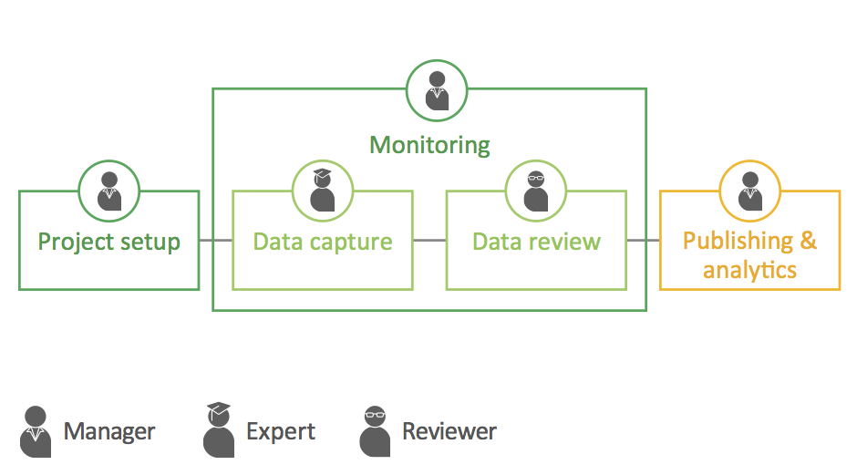

---
### Data collection and management

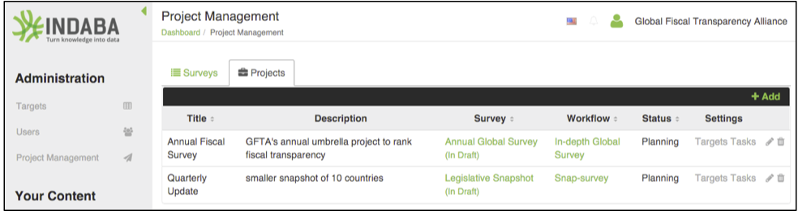

---
### Data review and dissemination

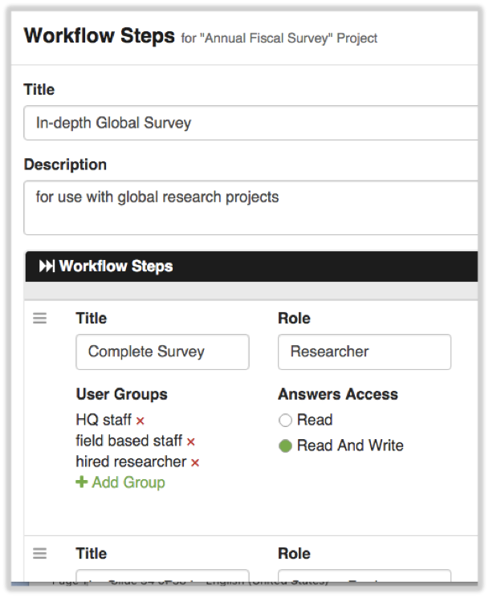

---

## Prerequisites
### Backend
- Node.js (v5 - we recommend using [node version manager](https://github.com/creationix/nvm))
- PostgreSQL
- pgAdmin (optional)
- memcached
- nginx (for server deployment)
- Docker

### Frontend
- Ruby
- Compass
- Node.js and npm

---

## Deployment with Docker

1. Set up a Docker Postgres container:

`docker run --name indaba-postgres -ti -e POSTGRES_PASSWORD=indabapassword -p 5432:5432 -v /Amida/greyscale/backend/db_setup:/shared-volume -d postgres:9.6.5-alpine`

***
`--name indaba-postgres`

`--name <new container name that will be seen by running 'docker ps'>`

***
`-ti`

`("terminal interactive" mode; properly formats output when you are using an interactive shell inside)`

***
`-e POSTGRES_PASSWORD=indabapassword`

`-e <environment variable assignment. This is the same as running 'export POSTGRES_PASSWORD=indabapassword'> from inside the docker image`

***
`-p 5432:5432`

`-p <port forwarded from container>:<port forwarded to on local machine>`

***
`-v /Amida/greyscale/backend/db_setup:/shared-volume`

`-v <ABSOLUTE path to existing directory on local machine>:<ABSOLUTE path to new directory in container>`

***
`-d`

`(run in detached mode. To attach run 'docker attach <name, as seen by 'docker ps'>'; to dettach ctrl-p, ctrl-q)`

***
`postgres:9.6.5-alpine`

`<docker image as seen by running 'docker ps'>:<docker tag as seen by running 'docker ps'>`

-(A previous version of this README.md file did not lock the tag, therefore it is probable that different installations are running different versions of PostgreSQL)

***

- Running the command for the first time should produce a screen similar to the image below
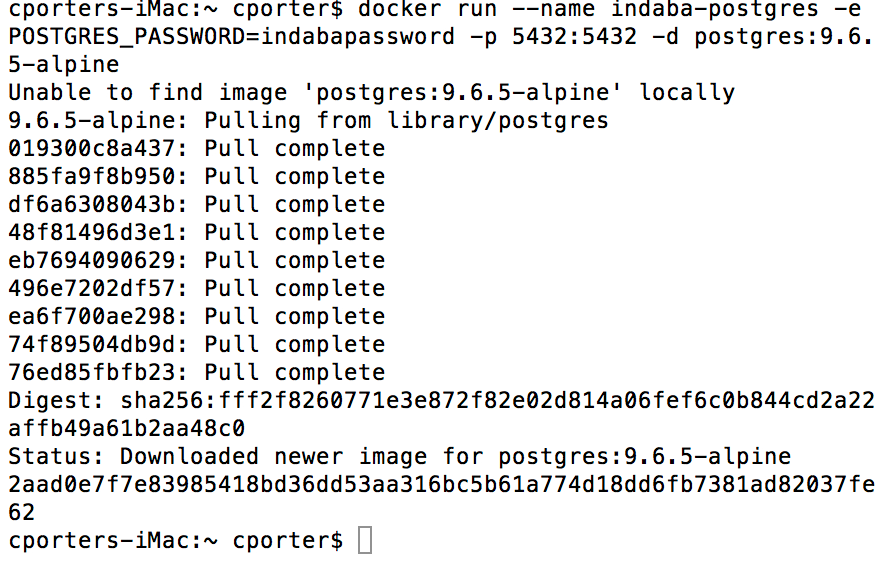
(Note: This image is missing the -v and -ti flags)

- When running after the Docker image is already present on the Docker server, a result similar to the image below should appear
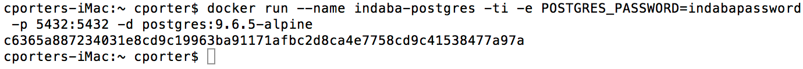
(Note: This image is missing the -v flag)

- If you have are running low on disk space or other system resources, run `docker ps -a` (the -a means "list all containers, even stopped containers") and check that you don't have a large number of un-needed or un-used docker containers. If you do, run `docker rm <name or container id>` for each container. If NONE of the docker containers are useful, run `docker rm $(docker ps -a -q)`. Please note, the previous command will give an error message for all running containers. To stop running containers, run `docker stop $(docker ps -a -q)`, you may then run `docker rm $(docker ps -a -q)` to remove all containers

2. Verify the indaba-postgres container was created and started by running

`docker ps`
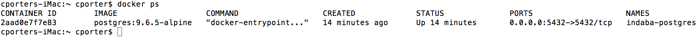

3. Start an interactive bash shell on the indaba-postgres container

`docker exec -ti indaba-postgres bash`
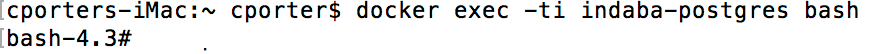
- Note: Use Ctrl-D to exit the bash shell. This will not kill the container since the main container process is postres

4. Create the indaba user:

`createuser -h localhost -U postgres -W -P -s indabauser`
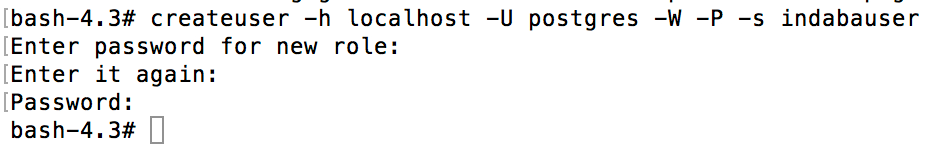

- The first prompts is requesting a new password to associate with the user indabauser (in PostgreSQL, role and and username mean the same thing)
- The second prompt is asking you to repeat the password
- The third prompt wants the password set with the POSTGRES_PASSWORD environment variable in step 1. If you are using defaults, the password is indabapassword

5. Create the indaba database:

`createdb -h localhost -U indabauser indaba`

6. Use `psql` to restore an indaba database (from `/greyscale/backend/db_setup` ):

`psql -h localhost -U indabauser indaba < schema.indaba.sql`


- Note 1: At the time this README.md was modified, there were 851 lines of output
- Note 2: The schema import has errors related to the roles/usernames "sean" and "indaba". I (chris.porter) have not verified that these errors can safely be ignored. If you have issues, please look into problems associated with the schema import.

`psql -h localhost -U indabauser indaba < /shared-volume/data.indaba.sql`
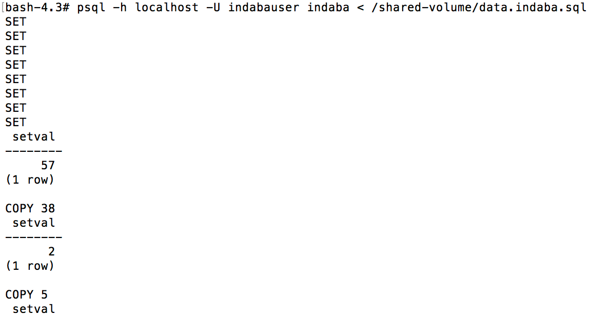
.
.
.

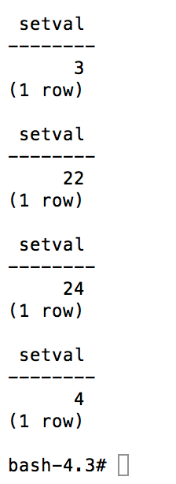
- Note: At the time this README.md was modified, there were 574 lines of output

7. Exit the bash terminal

`ctrl-d`

This will exit the bash shell in the container and return you to the local machine

8. Optional - Commit Docker container

Most people will not want to re-run the above commands every time they start a new docker container.

- Stop the docker container
`docker stop indaba-postgres`

- Tag the new docker image. Remember, "docker ps -q -l" gets the ID of the last stopped container. If the indaba-postgres container was not the last stopped image, or if you are not sure if it was the last stopped image, you can get a list of all stopped docker containers by typing "docker ps -a"
`docker commit $(docker ps -q -l) indaba-postgres`

- Start a new Docker container based on the new image
`docker run docker ps -q -l`

9. Get the IP address of the PostgreSQL container:

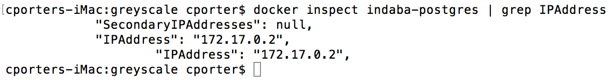
`docker inspect indaba-postgres | grep IPAddress`

10. Set local environment variables:

`export AUTH_SALT='nMsDo)_1fh' && export RDS_USERNAME=indabauser && export RDS_PASSWORD=indabapassword && export RDS_HOSTNAME=<ip address above> && export INDABA_PG_DB=indaba && export INDABA_ENV=dev`

11. Start docker-compose from the greyscale root dir:

`docker-compose up -d`

12. Confirm everything is running with `docker ps`

13. At this point, you will now have a functioning Indaba backend with accompanying services. You can now run a local Indaba client for testing against the backend and services. The client should make sure to set the following vars in the `.env`:
    - NODE_ENV=development
    - API_URL=localhost:3005
    - AUTH_API_URL=localhost:4000
    - SURVEY_API_URL=localhost:9005
    - MESSAGING_API_URL=localhost:4001
    - REALM=testorg

14. If you need to free up space after development, run ``docker rmi `docker ps -aq` ``

## Configuration

A list of full environment variable settings is below.  They can be either manually set in the shell or can be included in the `.env` file.  Defaults indicated in paranthesis.

- INDABA_PG_USERNAME: Database user (db_user)
- INDABA_PG_DB: Database name (database)
- AUTH_SALT: Authorization salt (saltForHash)
- INDABA_PG_TESTUSER: Dtabase user for test (indabauser)
- INDABA_USER_TOKEN: Token for user authentication.  Makes it possible to use API without authentication for a particular user.
- MESSAGE_SERVICE_URL: The root url for the application's message service (http://localhost:4002)
- SYS_MESSAGE_USER: The email field of the auth service user that is used to send system messages
- SYS_MESSAGE_PASSWORD: The auth service password for the user that is used to send system messages

## Deployment with Kubernetes (AWS)
See the [paper](https://paper.dropbox.com/doc/Amida-Microservices-Kubernetes-Deployment-Xsz32zX8nwT9qctitGNVc) write-up for instructions on how to deploy with Kubernetes on AWS using `Kops`. The `kubernetes.yml` file included in the project root directory contains the deployment definition for this project.

### A Few Things to Note
- The  `.pgpass` file is needed by the `Dockerfile` to run the `seed.js` script upon startup. This is only necessary when seeding password protected databases. You will need to ensure that the file is configured with the correct database parameters in this format `hostname:port:database:username:password`.

- If using AWS' Elasticache and RDS to deploy memcached and postgres respectively, make sure the instance is configured with the appropriate security groups to allow traffic from the cluster's instance. The paper doc referenced above describes how this can be done.

## Deployment with Google Cloud (Kubernetes)
NOTE: Container Engine SQL support in Google Cloud is bad right now and will probably change.
For this reason, we do not give DB setup instructions here. You may attempt to use Google Cloud
SQL, or use a Postgres container as shown above.

1. Configure `gcloud` defaults
```
gcloud config set project PROJECT_ID
gcloud config set compute/zone ZONE_ID
```
2. Launch a cluster
```sh
gcloud container clusters create greyscale-cluster --num-nodes=3
# confirm the running nodes
gcloud compute instances list
```
3. Set the appropriate environment variables in `.env`

4. Use `kompose` to convert the docker-compose.yml into kubernetes .yaml files
```sh
# in the project root dir
kompose convert
```
5. Use `kubectl` to deploy the services
```sh
# you may need to authenticate first
gcloud auth application-default login
# create the pods
kubectl create -f indaba-frontend-service.yaml,memcached-service.yaml,indaba-backend-service.yaml,indaba-frontend-deployment.yaml,memcached-deployment.yaml,indaba-backend-deployment.yaml
# to verify in the kubernetes dashboard:
kubectl proxy
# then navigate to localhost:8001/ui
```
6. Cleanup the cluster when you are finished
```
gcloud container clusters delete greyscale-cluster
```

15. If you need to free up space after development, run ``docker rmi `docker ps -aq` ``
---

## Contributing

Contributors are welcome. See issues https://github.com/amida-tech/greyscale/issues

---

## Contributors

###### Amida team

- Dmitry Kachaev
- Mike Hiner
- Jacob Sachs
- Harry Rickards (summer '15 intern, MIT)
- Nadia Wallace (winter '15 intern, MIT)

---
## License

Licensed under [Apache 2.0](./LICENSE)
